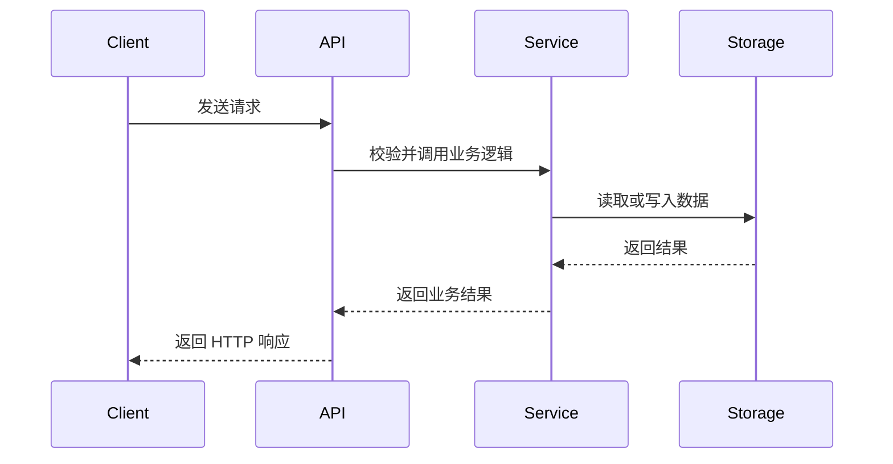

# Write Project Documentation

根据仓库中的实际实现，为后端 API 脚手架创建或更新开发文档。

文档重点：

1. 业务或技术流程
2. 实现原理与模块职责
3. 接入和使用方式
4. 配置、约束与错误处理
5. 测试和验证方法

所有技术描述必须能够从源码、配置、Schema、测试或仓库说明中获得证据。不得根据常见实践虚构项目行为。

## 工作流程

### 1. 确定范围

优先使用用户指定的范围：

- 文件或目录
- Git 暂存区
- 分支、提交或 diff
- 某个模块、功能、API 或工作流

对于 Git 暂存区，检查：

```bash
git diff --cached --name-status
git diff --cached
```

对于未指定文件的主题，先搜索入口点，再检查解释该功能所需的最小范围，包括：

- 路由和端点
- Service、Repository 或核心模块
- Schema 和数据模型
- 中间件
- 配置和环境绑定
- 测试
- 直接调用方和依赖

不要无目的地分析整个仓库。

### 2. 阅读仓库约定

首先检查适用的仓库说明，例如：

- `AGENTS.md`
- `README.md`
- `docs/`
- 文档站配置
- 相邻文档页面
- OpenAPI 或其他生成规范

遵循现有文档的：

- 语言和术语
- 标题层级
- front matter
- 链接格式
- 文件命名
- 导航结构
- 包管理器和命令风格

### 3. 建立实现映射

在编写文档前，确认以下内容：

- 功能入口
- 请求、控制和数据流
- 核心模块及其职责
- 模块之间的调用关系
- 数据模型和状态变化
- 配置、绑定和运行时依赖
- 正常流程和失败流程
- 测试覆盖的预期行为

重要结论应能够对应到具体文件、函数、类、类型或配置项。

源码和当前配置的优先级高于可能过时的已有说明。测试用于确认预期行为，但不得仅根据测试虚构生产实现。

### 4. 创建或更新文档

按以下顺序选择目标文件：

1. 用户指定的文档路径
2. 已存在的权威文档页面
3. 仓库约定的文档目录中新建页面

避免为同一主题创建重复文档。

更新已有文档时：

- 保留仍然正确的内容
- 保留已有写作风格和元数据
- 修正本次范围内的过时描述
- 不扩展为无关的全局文档重写

## 文档结构

根据主题选择必要章节，不必机械套用全部内容。

推荐结构：

```markdown
# 模块名称

## 概述

说明模块解决的问题、使用场景和范围。

## 核心流程

使用 Mermaid 展示请求流、控制流、数据流或状态变化。

## 实现原理

说明核心组件、职责边界、关键机制和设计约束。

## 项目结构

列出与当前模块直接相关的文件和目录。

## 使用方式

说明如何配置、调用、接入和验证。

## API 或数据结构

说明端点、请求参数、响应结构、Schema、绑定或数据模型。

## 错误处理与限制

说明实际存在的失败路径、约束和已知限制。

## 测试与验证

说明仓库中可执行的测试、检查或构建命令。

## 扩展方式

仅在代码中存在明确扩展模式时说明。
```

## 流程图要求

当模块包含两个以上组件、跨层调用、状态变化或异步处理时，优先使用 Mermaid。

根据场景选择图类型：

- `flowchart`：请求流、数据流、模块调用
- `sequenceDiagram`：客户端、API、服务和外部系统交互
- `stateDiagram-v2`：订单、任务或工作流状态变化
- `erDiagram`：核心数据模型关系

流程图必须与实际实现一致。

推荐优先展示完整主流程，例如：



不得为了增加视觉内容而添加没有实际信息价值的图。

## 原理说明要求

原理说明应回答：

- 请求从哪里进入
- 核心逻辑由哪个模块负责
- 数据如何传递和存储
- 为什么存在当前的职责划分
- 哪些配置影响运行行为
- 失败时如何处理
- 当前实现有哪些约束

只有在以下情况下才能解释设计原因：

- 仓库中已有明确说明
- 可以从代码约束直接得出
- 测试明确体现了该设计目标

无法直接确认的设计解释必须标记为“推断”，不得作为确定事实描述。

## 使用说明要求

使用说明应基于当前项目提供可执行步骤，包括必要的：

- 安装或初始化命令
- 配置项
- 环境变量名称
- Cloudflare Binding 或其他运行时绑定
- 路由注册方式
- 调用示例
- 请求和响应示例
- 测试命令
- 本地运行和部署前验证

不得虚构：

- API
- 路径
- 命令
- 环境变量
- 配置键
- 数据库字段
- 状态码
- 响应结构
- 文件路径

## 代码示例

代码示例应：

- 直接来自当前实现，或仅做最小简化
- 保留准确的名称、类型、导入和调用方式
- 聚焦当前主题
- 避免复制大段实现代码
- 对不可直接运行的内容标记为伪代码或说明性示例

目录树只保留与当前模块相关的文件。

不得在文档中暴露密钥、Token、凭证、私有配置值或其他敏感信息。

## 编辑限制

除非用户明确要求，否则不得修改：

- 实现代码
- 数据库结构
- 生成文件
- 环境配置
- CI 配置
- 与文档无关的文件

仅当新文档需要被发现，并且仓库已有相应约定时，才更新导航或侧边栏。

不得将 `AGENTS.md` 等 Agent 内部说明发布为面向项目使用者的文档。

## 验证

完成文档后执行以下检查：

1. 核对技术描述、路径、符号、命令和示例。
2. 确认本地链接和引用文件存在。
3. 确认 API、Schema、状态码和响应结构与实现一致。
4. 检查 Mermaid 语法和流程关系。
5. 在仓库支持时运行文档格式检查、链接检查或站点构建。
6. 检查 Git 状态和最终 diff，确保只修改预期文件。
7. 区分本次文档变更与已有的无关变更。

不得声称执行了未实际运行的命令或验证。

## 完成报告

最终报告应简要说明：

- 创建或更新了哪些文档
- 文档覆盖了哪些模块和流程
- 主要依据了哪些代码范围
- 添加了哪些流程图和使用说明
- 执行了哪些验证
- 是否仍存在无法从仓库确认的内容

不得将暂存区、分支或 diff 中的实现描述为已经部署或发布。
