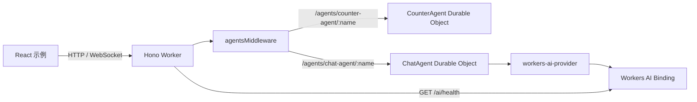

# AI 与 Agents

项目使用 Cloudflare Agents SDK 构建有状态 Agent，并通过 Workers AI Binding 调用大语言模型。当前包含两个示例：

- `CounterAgent`：演示 Agent 状态、HTTP 请求和 RPC 方法。
- `ChatAgent`：保存聊天消息，通过 Workers AI 生成并流式返回回答。

此外，`GET /ai/health` 会直接调用一个 Workers AI 模型，用于验证 AI Binding 是否可用。

## 架构概览



相关文件按职责分布：

```text
src/
├── agents/
│   ├── counter.ts              # 状态、HTTP 和 RPC 示例
│   ├── chat.ts                 # 聊天消息处理和模型调用
│   └── index.ts                # 导出 Agent 类
├── endpoints/ai/health.ts      # Workers AI Binding 探针
├── config.ts                   # Agent 路由中间件与跨域配置
└── index.ts                    # 注册 /ai/health 并导出 Agent 类

examples/agent-react-example/
├── .env.example                # 前端 Worker Origin
└── src/
    ├── Agents.tsx              # CounterAgent React 客户端
    └── Chat.tsx                # ChatAgent React 客户端

test/unit/agent.test.ts         # Agent HTTP、RPC 和 WebSocket 测试
wrangler.jsonc                  # AI 与 Durable Object Binding、迁移
```

## 依赖职责

| 依赖                              | 当前用途                                      |
| --------------------------------- | --------------------------------------------- |
| `agents`                          | Agent 基类、状态管理、RPC 与 React 客户端连接 |
| `hono-agents`                     | 将 `/agents/*` 请求路由到对应 Agent 实例      |
| `@cloudflare/ai-chat`             | 服务端 `AIChatAgent` 和 React `useAgentChat`  |
| `ai`                              | 消息转换和流式文本生成                        |
| `workers-ai-provider`             | 将 Workers AI Binding 适配为 AI SDK Provider  |
| `@cloudflare/vitest-pool-workers` | 在 Workers Runtime 中测试 Agent               |

## Binding 与 Durable Object 配置

`wrangler.jsonc` 声明了 Workers AI Binding：

```jsonc
{
  "ai": {
    "binding": "AI",
    "remote": true,
  },
}
```

运行时代码通过 `env.AI` 或 `c.env.AI` 访问该 Binding。Workers AI 没有本地模型模拟，因此本地运行 `wrangler dev` 时，Worker 和 Agent 在本机执行，模型推理仍通过远程 Binding 在 Cloudflare 上完成。远程推理需要有效的 Wrangler 登录状态和可访问 Cloudflare 的网络，并会产生实际的 Workers AI 用量。

两个 Agent 都注册为 Durable Object：

```jsonc
{
  "durable_objects": {
    "bindings": [
      {
        "name": "CounterAgent",
        "class_name": "CounterAgent",
      },
      {
        "name": "ChatAgent",
        "class_name": "ChatAgent",
      },
    ],
  },
  "migrations": [
    {
      "tag": "v1",
      "new_sqlite_classes": ["CounterAgent"],
    },
    {
      "tag": "v2",
      "new_sqlite_classes": ["ChatAgent"],
    },
  ],
}
```

Agent URL 使用类名转换后的 kebab-case 名称：

```text
CounterAgent -> /agents/counter-agent/:name
ChatAgent    -> /agents/chat-agent/:name
```

路径中的 `:name` 标识一个 Agent 实例。例如，`chat` 和 `agent-123` 是两个相互独立的 `ChatAgent` 实例，各自维护自己的消息和存储。

修改 Binding 后需要重新生成 Worker 类型：

```bash
bun run cf-typegen
```

生成的 `worker-configuration.d.ts` 会为 `Env` 声明 `AI`、`CounterAgent` 和 `ChatAgent`。

> 新增 Durable Object 类或改变其存储类型时，还需要在 `wrangler.jsonc` 中添加新的迁移标签。不要修改已经部署过的迁移。

## Agent 路由与鉴权

`src/config.ts` 在所有路径上启用 `agentsMiddleware()`，由它识别 `/agents/:agent/:name` 并将请求转发给对应的 Agent 实例。`/agents/*` 还启用了跨域配置，允许 `GET`、`POST` 和 `OPTIONS` 请求。

当前 JWT 中间件只应用于 `/api/*`，因此 `/agents/*` 和 `/ai/health` 都是公开路径：

| 入口                                 | 当前行为                                   | JWT |
| ------------------------------------ | ------------------------------------------ | --- |
| `GET /ai/health`                     | 直接执行一次 Workers AI 推理               | 否  |
| `GET /agents/counter-agent/:name`    | 返回 Counter 状态和请求 URL                | 否  |
| 普通 `GET /agents/chat-agent/:name`  | 返回 `404`，`ChatAgent` 未实现 `onRequest` | 否  |
| WebSocket `/agents/chat-agent/:name` | 建立聊天协议连接                           | 否  |

`ChatAgent.healthCheck()` 是供 Durable Object Stub 调用的 RPC 方法，不是 `/agents/chat-agent/:name/health` HTTP 端点。

## Agent 状态管理

`CounterAgent` 使用 `initialState` 声明初始状态，并通过 `setState()` 更新状态：

```typescript
export type CounterState = {
  count: number;
};

export class CounterAgent extends Agent<Cloudflare.Env, CounterState> {
  initialState: CounterState = { count: 0 };

  onRequest(request: Request): Promise<Response> | Response {
    return Response.json({ count: this.state.count, url: request.url });
  }

  @callable()
  increment() {
    this.setState({ count: this.state.count + 1 });
    return this.state.count;
  }

  @callable()
  decrement() {
    this.setState({ count: this.state.count - 1 });
    return this.state.count;
  }
}
```

- `onRequest()` 处理转发到该实例的普通 HTTP 请求。
- `@callable()` 将方法暴露给 Agent RPC 客户端。
- `this.state` 读取当前状态，`this.setState()` 保存新状态并通知已连接的客户端。
- 相同 Agent 名称会定位到相同实例，因此 HTTP、RPC 和 React 连接可以观察同一份状态。

## ChatAgent

### 服务端实现

`ChatAgent` 继承 `AIChatAgent`，并实现 `onChatMessage()`：

```typescript
import { AIChatAgent } from "@cloudflare/ai-chat";
import { convertToModelMessages, streamText } from "ai";
import { createWorkersAI } from "workers-ai-provider";

export class ChatAgent extends AIChatAgent {
  healthCheck() {
    return new Response("OK");
  }

  async onChatMessage() {
    const workersai = createWorkersAI({ binding: this.env.AI });

    const result = streamText({
      model: workersai("@cf/qwen/qwq-32b"),
      messages: await convertToModelMessages(this.messages),
    });

    return result.toUIMessageStreamResponse();
  }
}
```

一条聊天消息按以下流程处理：

1. `useAgentChat` 通过 Agent 连接发送用户消息。
2. `AIChatAgent` 保存并向 `onChatMessage()` 提供当前实例的 `this.messages`。
3. `convertToModelMessages()` 将 UI 消息转换为模型消息。
4. `createWorkersAI()` 使用当前实例的 `this.env.AI` 创建 Provider。
5. `streamText()` 调用 `@cf/qwen/qwq-32b`，并逐步生成回答。
6. `toUIMessageStreamResponse()` 将模型输出转换为客户端可消费的 UI Message Stream。

`AIChatAgent` 基于 Durable Object SQLite 保存对话，并支持断线后的流恢复。当前模型名称集中在 `src/agents/chat.ts`；替换模型时应先确认新模型与 `workers-ai-provider`、消息格式及流式返回兼容。

### React 客户端

前端示例先使用 `useAgent()` 定位 `chat-agent` 的 `chat` 实例，再将连接交给 `useAgentChat()`：

```tsx
import { useAgentChat } from "@cloudflare/ai-chat/react";
import { useAgent } from "agents/react";

const agent = useAgent({
  agent: "chat-agent",
  name: "chat",
  host: process.env.BUN_PUBLIC_API_ORIGIN,
});

const { messages, sendMessage, status } = useAgentChat({ agent });
```

- `messages` 是当前会话的 UI 消息列表。
- `sendMessage({ text })` 发送用户文本。
- `status` 表示聊天状态；示例仅在状态为 `ready` 时启用发送按钮。
- 文本内容位于 `message.parts` 中，示例只渲染 `part.type === "text"` 的部分。

前后端分离时，复制示例环境文件并设置 Worker Origin：

```bash
cd examples/agent-react-example
cp .env.example .env
```

本地 Worker：

```dotenv
BUN_PUBLIC_API_ORIGIN=http://localhost:8787
```

连接已部署 Worker 时，将值替换为 Worker 的 HTTPS Origin。该变量通过 Bun 的 `BUN_PUBLIC_*` 机制进入浏览器构建产物，因此其中不得保存密钥。修改 `.env` 后需要重启前端开发服务器。

## AI Binding 探针

`GET /ai/health` 通过 `c.env.AI.run()` 调用 `@cf/meta/llama-3.2-1b-instruct`：

```typescript
export const AIHealth = async (c: AppContext) => {
  const result = await c.env.AI.run("@cf/meta/llama-3.2-1b-instruct", {
    prompt: "Only respond with AI_OK",
    max_tokens: 20,
  });

  return c.json(result);
};
```

启动 Worker 后可进行手动检查：

```bash
bun run start
```

```bash
curl http://localhost:8787/ai/health
```

该端点会执行真实推理，不是只检查进程存活的轻量级健康检查。模型请求失败时，异常会进入项目的全局错误处理器。

## 本地开发

分别启动 Worker 和 React 示例：

```bash
# 项目根目录
bun run start
```

```bash
# examples/agent-react-example
bun install --frozen-lockfile
cp .env.example .env
bun run dev
```

本地开发时需要区分两个执行位置：

- Worker、Hono 中间件和 Durable Object Agent 在本地 Workers Runtime 中执行。
- `AI` 配置了 `remote: true`，模型推理通过远程 Binding 在 Cloudflare 上执行。

因此 CounterAgent 可以完全在本地运行，而 ChatAgent 只有在远程 AI Binding 可用时才能生成模型回答。

### 常见问题

#### 普通 GET 请求 ChatAgent 返回 404

这是当前实现的预期行为。`ChatAgent` 没有实现 `onRequest()`，聊天客户端使用的是 WebSocket 和 AI Chat 协议，而不是把普通 `GET` 响应解析为聊天消息。测试也明确断言普通 GET 返回 `404`。

#### 前端显示 `Failed to fetch`

按以下顺序检查：

1. `BUN_PUBLIC_API_ORIGIN` 是否指向正在运行的 Worker Origin。
2. 修改 `.env` 后是否重启了 Bun 前端开发服务器。
3. 浏览器是否能够访问 `${BUN_PUBLIC_API_ORIGIN}/health`。
4. `/agents/chat-agent/chat` 的 WebSocket 握手是否成功。
5. 反向代理是否支持 WebSocket Upgrade。

当前项目只在 `/agents/*` 上配置跨域；如果前端直接请求其他 Worker 路径，还需要为这些路径单独配置 CORS。

## 测试

Agent 测试位于 `test/unit/agent.test.ts`，使用 `@cloudflare/vitest-pool-workers` 提供的 Workers Runtime。`vitest.config.ts` 同时加载 `agents/vite`，并读取 `wrangler.jsonc` 中的 Durable Object 配置。

运行 Agent 测试：

```bash
bun run test -- test/unit/agent.test.ts
```

当前测试覆盖：

- 通过 `app.fetch(request, env, ctx)` 和 Worker 默认导出访问 CounterAgent。
- 通过 `env.CounterAgent.getByName()` 调用 `increment()`、`decrement()` RPC，并确认状态持久化。
- 确认 ChatAgent 的普通 HTTP GET 返回 `404`。
- 通过 `env.ChatAgent.getByName()` 调用 `healthCheck()` RPC。
- 确认 ChatAgent WebSocket Upgrade 返回 `101`。

RPC 测试示例：

```typescript
const namespace = env.ChatAgent as unknown as DurableObjectNamespace<ChatAgent>;
const agent = namespace.getByName("agent-123");

const response = await agent.healthCheck();
expect(response.status).toBe(200);
expect(await response.text()).toBe("OK");
```

当前自动化测试没有调用 `ChatAgent.onChatMessage()`，也没有断言真实模型回答。这样可以避免测试依赖远程网络、模型可用性、配额和非确定性输出；`/ai/health` 与 React Chat 示例承担人工集成验证。若以后增加模型集成测试，应将其与默认测试套件区分，并断言协议、状态码和流结构，而不是固定回答文本。

## 参考资料

- [Cloudflare Agents：Chat agents](https://developers.cloudflare.com/agents/communication-channels/chat/chat-agents/)
- [Cloudflare Agents：Testing your Agents](https://developers.cloudflare.com/agents/getting-started/testing-your-agent/)
- [Cloudflare Workers：Local development](https://developers.cloudflare.com/workers/local-development/)
- [Cloudflare Workers：Supported bindings per development mode](https://developers.cloudflare.com/workers/local-development/bindings-per-env/)
