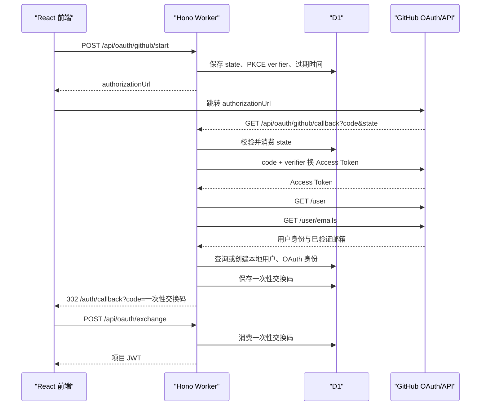

# OAuth 登录

使用 Google/GitHub 完成第三方身份认证，认证成功后仍由本项目签发自己的 JWT。

```mermaid
sequenceDiagram
    participant UI as "React 前端"
    participant API as "Hono Worker"
    participant DB as "D1"
    participant GitHub as "GitHub OAuth/API"

    UI->>API: POST /api/oauth/github/start
    API->>DB: 保存 state、PKCE verifier、过期时间
    API-->>UI: authorizationUrl
    UI->>GitHub: 跳转 authorizationUrl
    GitHub-->>API: GET /api/oauth/github/callback?code&state
    API->>DB: 校验并消费 state
    API->>GitHub: code + verifier 换 Access Token
    GitHub-->>API: Access Token
    API->>GitHub: GET /user
    API->>GitHub: GET /user/emails
    GitHub-->>API: 用户身份与已验证邮箱
    API->>DB: 查询或创建本地用户、OAuth 身份
    API->>DB: 保存一次性交换码
    API-->>UI: 302 /auth/callback?code=一次性交换码
    UI->>API: POST /api/oauth/exchange
    API->>DB: 消费一次性交换码
    API-->>UI: 项目 JWT
```
