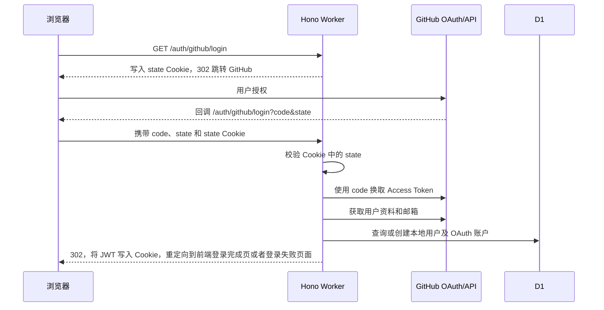

# OAuth 登录

> 以 Github OAuth 为例。

项目通过 GitHub OAuth 完成第三方身份认证。GitHub 负责确认用户身份，认证成功后由本项目创建或更新本地用户，并签发项目 JWT。后续访问 `/api/*` 接口时携带该 JWT 机械能认证。

项目下 `src/endpoints/auth/github-login` 提供 默认实现、`@hono/oauth-providers` 两个方案。

## 登录流程



## 环境配置

需要去 Github Settings 创建 OAuth App，获取 `GITHUB_CLIENT_ID` 和 `GITHUB_CLIENT_SECRET`。

```bash
JWT_SECRET=replace_with_a_long_random_secret
GITHUB_CLIENT_ID=replace_with_github_client_id
GITHUB_CLIENT_SECRET=replace_with_github_client_secret
```

线上环境使用 Wrangler Secret 保存凭据：

```bash
bunx wrangler secret put JWT_SECRET
bunx wrangler secret put GITHUB_CLIENT_ID
bunx wrangler secret put GITHUB_CLIENT_SECRET
```

在 GitHub OAuth App 中，将 Authorization callback URL 配置为：

```text
https://<你的 Worker 域名>/auth/github/login
```

## Hono Oauth Providers 实现

```typescript
openapi.use("/auth/github/login", GithubAuthMiddlewares);
openapi.get("/auth/github/login", GithubHonoAuthLogin);
```

首次请求与 GitHub 回调共用 `GET /auth/github/login`。

具体步骤如下：

1. 浏览器访问 `GET /auth/github/login`。
2. `GithubAuthMiddlewares` 生成随机 `state`，将其写入名为 `state` 的 Cookie，并返回 `302` 跳转到 GitHub 授权页。
3. 中间件请求 `read:user` 和 `user:email` 权限。当前配置的 `oauthApp: true` 表示使用 GitHub OAuth App。
4. GitHub 授权完成后，将浏览器重定向回同一路径，并附带 `code` 和 `state` 查询参数。
5. 中间件比较查询参数中的 `state` 与 Cookie 中保存的值；不匹配或缺失时返回 `401`。
6. 中间件使用 `code`、`GITHUB_CLIENT_ID` 和 `GITHUB_CLIENT_SECRET` 换取 GitHub Access Token，然后请求 GitHub 用户资料与邮箱。
7. `GithubHonoAuthLogin` 从 Hono Context 中读取 `user-github`，并调用 `AuthQueries.loginWithGithub()` 关联本地身份。
8. 项目签发自己的 JWT，并以 `201 Created` 返回登录结果。

中间件写入的 `state` Cookie 有效期为 10 分钟，并设置了 `HttpOnly`、`Secure`、`SameSite=Lax` 和 `Path=/`。OAuth 登录依赖浏览器在回调时带回该 Cookie。

## 自定义 Oauth 实现

`GithubAuthLogin` 是保留的自定义 Oauth实现。同样以 GitHub 为例，流程如下：

1. 生成 `state`、PKCE `codeVerifier` 和 `codeChallenge`。
2. 将 OAuth 事务写入 KV 的 `oauth_transactions:<state>`，过期时间设为 5 分钟。
3. 将 `redirect_uri`、`state`、`code_challenge` 和 `code_challenge_method=S256` 发送给 GitHub。
4. 回调时从 KV 读取事务并检查过期时间。
5. 使用授权码与 `codeVerifier` 换取 GitHub Access Token。
6. 获取 GitHub 用户资料以及 primary、verified 邮箱，再执行本地身份映射和 JWT 签发。

OAuth 事务结构由 `OAuthTransactionsSchema` 校验，包含：

- `stateHash`、`provider`、`codeVerifier`
- `intent`、`initiatorUserId`
- `redirectTo`、`expiresAt`
- `exchangeCodeHash`、`exchangedAt`
- `consumedAt`、`resolvedUserId`
- `createdAt`、`updatedAt`

在 `wrangler.jsonc` 中声明了以下普通变量：

```diff
{
  "vars": {
+   "API_ORIGIN": "https://<你的 Worker 域名>",
  },
}
```

- `API_ORIGIN`：生成回调地址。

## 前端接入

前端通过页面跳转发起 OAuth：

```typescript
window.location.assign(`${apiOrigin}/auth/github/login`);
```

在授权完成后的重定向回调界面中， 从 Cookie 中解析 `auth`：

```typescript
const authCookie = document.cookie
  .split("; ")
  .find((row) => row.startsWith("auth="))
  ?.split("=")[1];
const auth = authCookie ? JSON.parse(decodeURIComponent(authCookie)) : null;
const token = auth?.token;
```

## 本地身份映射

GitHub 身份与本地用户分别存储在 `users_table` 和 `oauth_accounts_table`：

| 数据         | 存储位置               | 用途                                                     |
| ------------ | ---------------------- | -------------------------------------------------------- |
| 本地用户资料 | `users_table`          | 保存名称、邮箱和头像等业务用户信息                       |
| GitHub 身份  | `oauth_accounts_table` | 保存 GitHub 用户 ID、登录名、邮箱以及关联的本地 `userId` |
