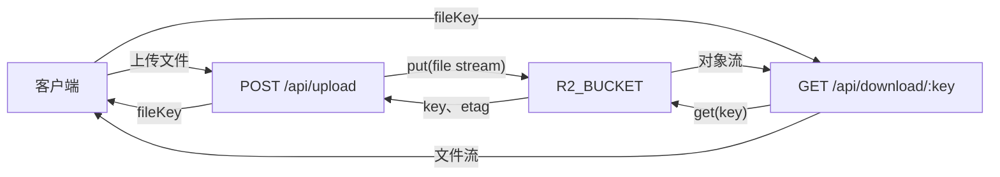

# 对象存储

项目通过 Cloudflare R2 提供文件上传与下载能力。

## 架构概览



相关实现按职责分布：

```text
src/
├── endpoints/oss/
│   ├── upload.ts       # multipart/form-data 接口和响应
│   └── download.ts     # 下载参数、响应头和对象流
├── libs/oss/
│   ├── upload.ts       # 生成 Key 并写入 R2
│   └── download.ts     # 读取 R2 对象及元数据
└── endpoints/todos/    # Todo 附件 DTO、创建和替换逻辑
```

## R2 Binding

Worker 通过 `R2_BUCKET` Binding 访问对象存储。`wrangler.jsonc` 中的配置如下：

```jsonc
{
  "r2_buckets": [
    {
      "binding": "R2_BUCKET",
      "bucket_name": "cloudflare-hono-api-starter",
    },
  ],
}
```

- `binding` 是代码中使用的属性名，对应 `c.env.R2_BUCKET`。
- `bucket_name` 是 Cloudflare 账户中的实际 Bucket 名称。
- 当前没有启用 `remote: true`，本地 `wrangler dev` 和 Workers Vitest 使用本地模拟的 R2 存储，不会直接写入远程 Bucket。

部署前需要确保账户中存在同名 Bucket：

```bash
bunx wrangler r2 buckets create cloudflare-hono-api-starter
```

查看已有 Bucket：

```bash
bun run cf-r2:list
```

Binding 发生变化后，重新生成 Worker 类型：

```bash
bun run cf-typegen
```

生成的 `worker-configuration.d.ts` 会在 `Env` 中声明：

```typescript
interface Env {
  R2_BUCKET: R2Bucket;
}
```

## 接口与鉴权

| 操作     | 方法与路径               | 运行时鉴权      | 成功状态码    |
| -------- | ------------------------ | --------------- | ------------- |
| 上传文件 | `POST /api/upload`       | 需要 Bearer JWT | `201 Created` |
| 下载文件 | `GET /api/download/:key` | 公开            | `200 OK`      |

JWT 中间件应用于 `/api/*`，但 `src/config.ts` 使用 Hono `except()` 放行 `/api/download/:key`。上传接口没有被放行，因此必须携带有效 JWT。完整认证流程参见[认证](./authentication.md)。

> 当前 OpenAPI 配置声明了全局 `bearerAuth`，Swagger UI 可能仍在下载接口上显示认证要求；运行时是否校验以 `src/config.ts` 的中间件配置为准。

## 上传文件

上传接口接收 `multipart/form-data`：

| 字段        | 类型     | 必填 | 说明                           |
| ----------- | -------- | ---- | ------------------------------ |
| `file`      | `File`   | 是   | 要写入 R2 的文件               |
| `directory` | `string` | 否   | Key 的目录前缀，例如 `avatars` |

不要手动设置 `Content-Type: multipart/form-data`。浏览器、`fetch()` 或 curl 会自动添加解析 FormData 所需的 `boundary`。

```bash
curl -X POST http://localhost:8787/api/upload \
  -H "Authorization: Bearer <jwt>" \
  -F "file=@./avatar.png" \
  -F "directory=avatars"
```

上传成功返回 `201 Created`：

```json
{
  "success": true,
  "data": {
    "key": "avatars/6eb64bc7-a2ac-49d2-b701-d0e00ee8565c-avatar.png",
    "etag": "<r2-etag>",
    "size": 10240,
    "contentType": "image/png"
  }
}
```

`UploadFile()` 按以下格式生成 Key：

```text
没有 directory：<uuid>-<原始文件名>
包含 directory：<directory>/<uuid>-<原始文件名>
```

写入 R2 时还会保存：

- HTTP metadata `contentType`：优先使用 `file.type`，没有类型时保存为 `application/octet-stream`。
- Custom metadata `originalName`：保存上传时的原始文件名，供下载响应生成 `Content-Disposition`。

缺少 `file` 时返回 `400 Missing file`；表单中的 `file` 不是 `File` 时返回 `400 Invalid file`。

## 下载文件

下载接口通过完整 R2 Key 获取对象：

```bash
curl \
  --output avatar.png \
  "http://localhost:8787/api/download/avatars%2F6eb64bc7-a2ac-49d2-b701-d0e00ee8565c-avatar.png"
```

当 Key 包含目录分隔符 `/` 时，必须把它编码为 `%2F`，否则 Hono 会把它解释成多个路径段，无法匹配单个 `:key` 参数。在 JavaScript 中应使用：

```typescript
const url = `/api/download/${encodeURIComponent(key)}`;
const response = await fetch(url);
```

Hono 匹配路由后会把参数还原为原始 Key，通过 `R2_BUCKET.get(key)` 读取对象。

成功响应直接返回对象流，并设置以下响应头：

- `Content-Disposition: attachment`：下载文件名优先使用 R2 的 `originalName`。
- `etag`：使用 R2 对象的 HTTP ETag。
- `Content-Type`：当前下载端点以 `application/octet-stream` 作为默认二进制类型。

对象不存在时返回：

```json
{
  "success": false,
  "error": {
    "message": "File not found"
  }
}
```

状态码为 `404 Not Found`。

## Example

Todo 请求不直接传输文件内容，只接收已经上传到 R2 的 `fileKey`。典型流程是：

1. 调用 `POST /api/upload` 上传文件。
2. 从响应中取得 `data.key`。
3. 创建或更新 Todo 时，把 Key 放入 `attachments`。
4. Todo 端点通过 `R2_BUCKET.get(fileKey)` 查询对象并生成 D1 附件元数据。

创建 Todo 示例：

```bash
curl -X POST http://localhost:8787/api/todos \
  -H "Authorization: Bearer <jwt>" \
  -H "Content-Type: application/json" \
  -d '{
    "title": "更新头像",
    "description": "检查新头像文件",
    "attachments": [
      {
        "fileKey": "avatars/6eb64bc7-a2ac-49d2-b701-d0e00ee8565c-avatar.png"
      }
    ]
  }'
```

客户端附件输入 DTO 只接受 `fileKey`。以下字段由服务端读取 R2 对象后生成，不应由客户端提交：

| D1 字段                  | 来源                        |
| ------------------------ | --------------------------- |
| `todoId`                 | 新建或更新的 Todo ID        |
| `fileKey`                | 客户端提交的 R2 Key         |
| `filePath`               | 当前与 `fileKey` 相同       |
| `fileSize`               | R2 对象大小                 |
| `fileHash`               | R2 对象 ETag                |
| `fileName`               | 当前从带 UUID 的 Key 中提取 |
| `createdAt`、`updatedAt` | Worker 生成的 ISO 时间      |

`todo_attachments_table.todoId` 外键指向 `todos_table.id`，并配置 `ON UPDATE CASCADE` 和 `ON DELETE CASCADE`。删除 Todo 时，D1 中关联的附件元数据会级联删除。

Todo 创建、详情和更新响应使用 `todoVo`，其中会包含附件数组。分页 Todo 列表使用 `pageTodoVo`，当前不包含附件数据。

### 更新语义

`POST /api/todos/:id` 对 `attachments` 使用三态语义：

- 不传 `attachments`：保留现有附件元数据。
- 传入 `attachments: []`：清空该 Todo 的附件元数据。
- 传入一个或多个 `fileKey`：用新附件替换现有附件元数据。

替换附件时，`TodoQueries.updateById()` 使用 `db.batch()` 按顺序执行 Todo 更新、旧附件删除和新附件插入。批次中的任意 D1 语句失败时，本次 D1 更新不会留下只完成一部分的附件状态。D1 批处理约定参见[事务](./transaction.md)。

## 数据一致性边界

R2 和 D1 是两个独立的存储系统，当前实现没有跨存储事务：

- 文件必须先上传到 R2，之后才能把 `fileKey` 关联到 Todo。
- Todo 创建时先写入 Todo，再写入附件元数据；这两次 D1 写入当前不在同一个 `db.batch()` 中。
- 更新、清空或删除 Todo 附件只修改 D1 元数据，不会删除 R2 中的对象。
- 当前没有删除 R2 对象的 API，因此被替换或取消关联的文件可能继续保留在 Bucket 中。
- 创建或更新 Todo 时，不存在的 R2 Key 会被过滤，不会写入附件表。更新请求中的 Key 全部无效时，生成的附件数组为空，会清空现有附件元数据。

需要实现文件回收时，应根据业务保留策略单独设计 R2 对象删除或定期清理流程，不要仅依赖 D1 外键级联。

## 测试

R2 测试在 Workers Runtime 中运行，并使用 `wrangler.jsonc` 提供的本地 `R2_BUCKET` Binding。

- `test/unit/oss.test.ts`：直接调用 `UploadFile()`，再从 R2 读取对象并核对内容。
- `test/integration/oss/oss.test.ts`：覆盖认证上传、普通下载、目录 Key 下载、缺少文件和对象不存在。
- `test/integration/todos/todo.test.ts`：覆盖上传文件后创建 Todo、查询附件以及替换附件。

运行相关测试：

```bash
bun run test -- test/unit/oss.test.ts \
  test/integration/oss/oss.test.ts \
  test/integration/todos/todo.test.ts
```

运行完整检查和文档构建：

```bash
bun run check
bun run test
bun run docs:build
```

测试环境和 `exports.default.fetch()` 请求方式参见[测试](./testing.md)。
